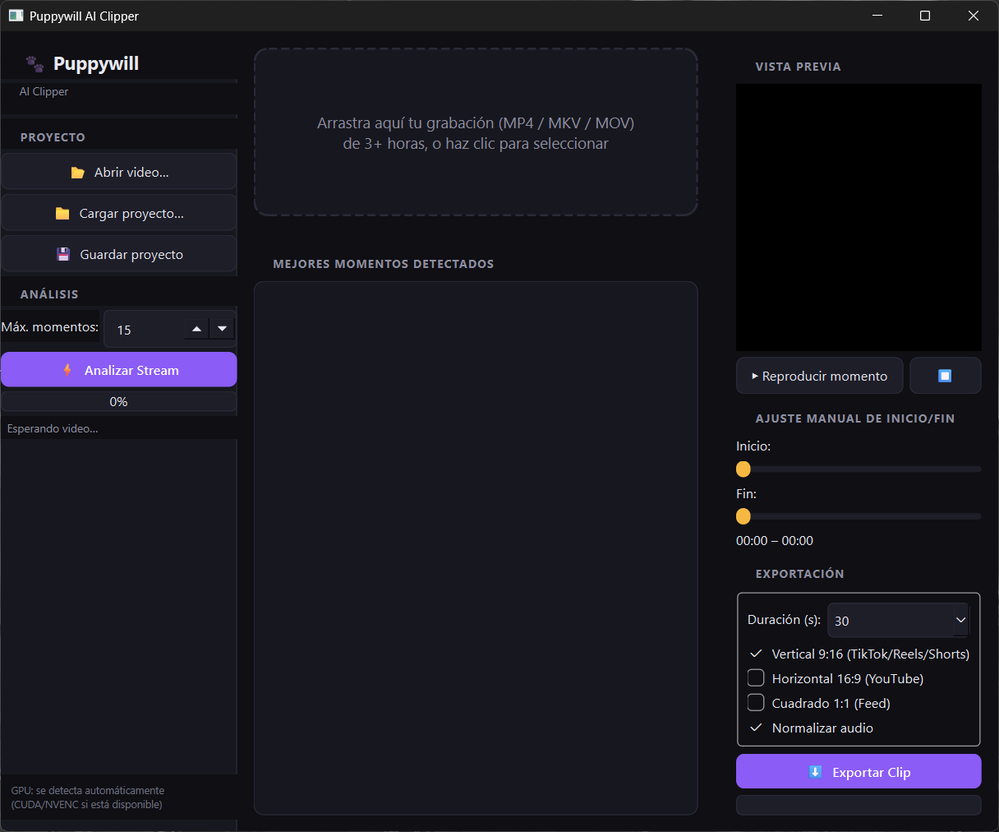

# 🐾 Puppywill AI Clipper

App de escritorio para Windows que analiza grabaciones largas de stream
(3+ horas) y encuentra automáticamente los mejores momentos, recortándolos
en clips limpios listos para editar en CapCut (o cualquier otro editor):
título, subtítulos, efectos y música los agregas tú después.

La detección usa **solo audio y video** (intensidad de audio, gritos/picos,
risas, movimiento de cámara, cambios de escena) — no hay transcripción ni
modelos de lenguaje involucrados, así que es rápida y no necesita GPU.

## Vista de la aplicación

<p align="center">
  
</p>

## ✨ Funciones

- **Detección de mejores momentos** combinando picos de audio, risas,
  movimiento visual y cambios de escena en una sola puntuación de calidad
  (0-100), con una etiqueta legible de por qué se eligió cada uno ("Pico de
  audio", "Acción alta", "Reacción", "Cierre detectado").
- **Estructura de highlight**: cada clip se arma con el pico de intensidad
  cayendo ~60-75% de su duración (preparación breve → jugada → cierre o
  reacción), no centrado a ciegas, y el corte se ajusta dinámicamente para
  no cortar a mitad de una acción sin resolución.
- **Agrupación de picos cercanos**: si varias jugadas casi consecutivas
  disparan el detector, se quedan con la de mejor puntuación en vez de
  entregar clips casi idénticos.
- **Vista previa** integrada del momento seleccionado.
- **Ajuste manual** de inicio/fin con sliders, si quieres afinar el corte.
- **Duraciones predefinidas** de 15/30/45/60s (recalculan la ventana al
  vuelo, siempre con duración exacta).
- **Exportación multi-formato**: 9:16 (TikTok/Reels/Shorts), 16:9 (YouTube),
  1:1 (feed), en H.264/1080p/60fps, sin subtítulos ni marca de agua — el
  clip queda limpio para que edites en CapCut.
- **Normalización de audio** (loudnorm EBU R128) opcional.
- **"Guardar como"** en cada exportación: recuerda la última carpeta usada,
  pero puedes cambiar carpeta y nombre libremente cada vez.
- **Aceleración por GPU (NVENC)** automática si hay una GPU NVIDIA
  disponible; si no, exporta con CPU (libx264) sin que tengas que configurar
  nada.
- **Guardar/cargar proyecto** (`.pwproj`) para retomar el trabajo después.

## 📋 Requisitos

- Windows 10/11
- Python 3.10 - 3.12
- [FFmpeg](https://ffmpeg.org/download.html) (con `ffmpeg`/`ffprobe` en el PATH)
- GPU NVIDIA (opcional, solo acelera la exportación vía NVENC)

No hace falta PyTorch, CUDA ni ningún framework de IA: la detección de
momentos usa solo `numpy` (audio) y `opencv-python` (video).

## 📦 Instalación

### 1. Clona el repositorio

```powershell
git clone https://github.com/Puppywill/Puppywill-AI-Clipper.git
cd Puppywill-AI-Clipper
```

### 2. Verifica tu sistema (no instala nada, solo diagnostica)

```powershell
python setup_check.py
```

Te dice si falta FFmpeg, si tu GPU es detectada, si NVENC funciona, y qué
paquetes de Python faltan.

### 3. Instala FFmpeg (si `setup_check.py` lo marca como faltante)

```powershell
winget install ffmpeg
```
o descarga un build "full" desde https://www.gyan.dev/ffmpeg/builds/ y añade
la carpeta `bin` al PATH.

### 4. Instala las dependencias de Python

```powershell
pip install -r requirements.txt
```

### 5. Vuelve a correr la verificación

```powershell
python setup_check.py
```

Deberías ver ✅ en Python, FFmpeg y los tres paquetes (PySide6, opencv-python,
numpy). NVENC es opcional.

### 6. Ejecuta la app

```powershell
python main.py
```

## 🖱️ Acceso directo de escritorio (opcional)

El proyecto incluye un launcher de doble clic que no abre ventana de
consola y verifica dependencias antes de arrancar:

- `run_puppywill.pyw` — verifica FFmpeg/paquetes y abre la interfaz; si
  falta algo, muestra un mensaje claro en vez de fallar en silencio.
- `launch_puppywill.vbs` — punto de entrada del acceso directo; busca
  `pythonw.exe` en el PATH del sistema antes de intentar nada.

Para crear el acceso directo en tu escritorio: clic derecho sobre
`launch_puppywill.vbs` → **Crear acceso directo**, mueve el acceso directo
a tu escritorio, y cambia su icono (Propiedades → Cambiar icono) al de
`assets/puppywill_icon.ico`.

## 🎬 Cómo usarla

1. Arrastra tu grabación (MP4/MKV/MOV) a la ventana, o haz clic en la zona
   de arrastre para seleccionarla.
2. Pulsa **Analizar Stream**. La barra de progreso muestra cada etapa:
   extracción de audio, análisis de energía, análisis visual, scoring.
3. En la lista de la izquierda verás los momentos ordenados por puntuación
   de calidad, con las razones detectadas.
4. Selecciona un momento: se carga en la vista previa con el rango
   Inicio/Fin ya posicionado (pico ~60-75% del clip). Ajusta con los
   sliders si quieres afinar el corte manualmente.
5. Elige la duración (15/30/45/60s) y los formatos de salida (9:16 / 16:9 /
   1:1), y si quieres normalizar el audio.
6. Pulsa **Exportar Clip**. Por cada formato se abre "Guardar como" (con la
   última carpeta usada por defecto, pero puedes cambiarla). El resultado es
   un MP4 limpio, listo para importar en CapCut y editar ahí título,
   subtítulos, efectos y música.
7. Guarda el proyecto para retomar el trabajo más tarde sin perder los
   momentos detectados.

## 🧪 Tests

```powershell
python tests/test_pipeline.py
```

Prueba de humo end-to-end (no depende de PySide6 ni GPU): genera un video
sintético con picos de volumen simulados, corre el análisis real de
audio+video+scoring, verifica que detecta los picos correctos, y exporta
clips reales en los tres formatos verificando dimensiones con `ffprobe`.

## 🗂️ Estructura del proyecto

```
puppywill_ai_clipper/
├── main.py                      # punto de entrada (consola)
├── run_puppywill.pyw            # launcher de doble clic (sin consola)
├── launch_puppywill.vbs         # punto de entrada del acceso directo
├── setup_check.py               # diagnóstico de sistema (correr primero)
├── requirements.txt
├── assets/
│   ├── puppywill_icon.ico
│   └── puppywill_icon.png
├── tests/
│   └── test_pipeline.py         # prueba end-to-end real
└── app/
    ├── config.py                 # ajustes persistentes del usuario
    ├── core/
    │   ├── video_io.py           # validación/metadata de video (ffprobe)
    │   ├── audio_analysis.py     # energía, picos, risas (numpy)
    │   ├── visual_analysis.py    # movimiento, cortes de escena (opencv)
    │   ├── scoring.py            # detección de momentos + estructura de highlight
    │   ├── moment_detector.py    # orquesta el pipeline de análisis
    │   ├── clip_exporter.py      # exporta con FFmpeg (crop/normalize/GPU)
    │   └── project.py            # guardar/cargar proyectos .pwproj
    └── ui/
        ├── styles.py              # tema oscuro QSS
        ├── workers.py             # QThreads para análisis/exportación
        └── main_window.py         # ventana principal PySide6
```

## 🔮 Posibles próximas fases

- Seguimiento de rostro (face tracking) para posicionar automáticamente la
  cámara dentro del encuadre vertical.
- Música de fondo con biblioteca integrada (el mezclador de audio ya está
  implementado en `clip_exporter`, falta la biblioteca/selector en la UI).
- Restaurar momentos guardados en un proyecto sin tener que re-analizar.
